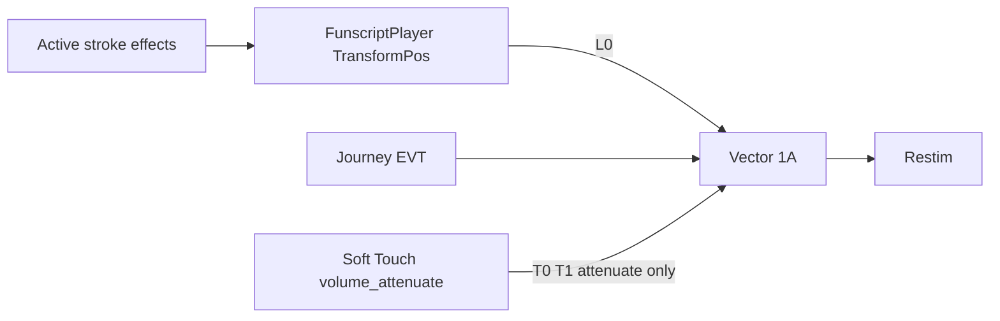

# Erosphere skills → automated L0 effects

**Plan home (global user rule):** [`.cursor/plans/erosphere-stim-effects.plan.md`](../../.cursor/plans/erosphere-stim-effects.plan.md)  
This `docs/plans/` file is an optional index mirror only — not a substitute for the project `.cursor/plans` copy.  
Never use `C:\Users\Jon\.cursor\plans\`.

## Why now

With Vector, Fap-Hero drives stim with **L0** (+ T0/T1 session ramp + optional `EVT`). Vector regenerates Restim axes from L0. That means Fap-Hero **stroke effects on L0** shape the whole stim path again — the old Restim compromise of “soft volume via V0 / ramp clock” is obsolete for Erosphere skills.

## Hard out of scope

| Item | Rule |
|------|------|
| **Soft Touch** (`soft_touch` / `volume_attenuate`) | **Do not change** — still attenuates Vector media-ramp progress via `SessionTimeline.SetAttenuationFactor` |
| Amulet / Psychic Divorce | Already correct (`shave_cooldown` 24h / 48h) |
| Divine Summoning | Not in Fap-Hero registry |
| Vector event definitions / EVT wire | Separate journey-events work; skills do not require new EVT names for this pass |
| Honor-system only (player rests by choice) | Rejected — user wants **automated** stim |

---

## Original CYOA intent (source of truth)

From `E:\CYOA-Erosphere\v1\skills.js` `applyEffect` — unlock videos exist as MP4s but are **not transcribed** in-repo. Code alerts are the written record:

| Skill | Original alert / behavior | Duration |
|-------|---------------------------|----------|
| **Feign Death** | “Rest during any **heartbeat rhythm** for the remainder of this round.” (honor) | Rest of round; once per round |
| **Blinding Light** | “Rest whenever your **chosen target appears on screen**…” (honor) | Rest of round; once per round |
| **Time Control** | “All **doubletime** strokes become **singletime** for the remainder of this round.” (honor) | Rest of round; once per round |

Unlock schedule (already in [`scripts/dev/erosphere-inferno/skill_unlocks.json`](../../scripts/dev/erosphere-inferno/skill_unlocks.json)): Feign after C02_002, Blinding after C02_004, Time Control after C02_EP5.

---

## Current Fap-Hero wiring (what’s wrong)

| Id | Kind today | End-user feel today | Problem |
|----|------------|---------------------|---------|
| `erosphere_feign_death` | `volume_attenuate` factor 0.30, `round_scoped` | Pulls T0/T1 ramp progress to 30% for the round — **only if** Vector media ramp is on; **no L0 change** | Ramp hack; ignores heartbeat intent |
| `erosphere_blinding_light` | `blackout_soft` → `blackout` + `volume_attenuate` 0.60, 30s | Video blackout + same ramp hack | Volume half is wrong mechanism; original was rest-when-on-screen |
| `erosphere_time_control` | **`skip_round`** | Instantly ends the round (same as stock Skip) | Completely wrong vs doubletime→singletime |
| `soft_touch` | `volume_attenuate` 0.5, 30s | Ramp soften 30s | **Leave alone** |
| Stock `skip_round` | `skip_round` | End round now | Keep; Time Control must **stop sharing** this kind |

Key code:

- Expand `blackout_soft`: [`Globals/InventoryService.cs`](../../Globals/InventoryService.cs) ~772–781
- Ramp attenuate: [`Globals/FunscriptPlayer.cs`](../../Globals/FunscriptPlayer.cs) `_UpdateVectorTimelineAttenuation` + [`Globals/SessionTimeline.cs`](../../Globals/SessionTimeline.cs)
- Skip signal: `InventoryService.ActivateUnlocked` when `kind == "skip_round"`
- Stroke transforms today: `scale` / `clamp` / `reverse` / `block` only — [`JourneyData.STROKE_EFFECT_KINDS`](../../scripts/journey_builder/JourneyData.gd); `TransformPos` in FunscriptPlayer; `HandyPoints.apply_effects`

---

## Proposed automated replacements (locked)

### 1. Feign Death — heavy L0 soften (round)

- Kind: `scale`, `factor: 0.3`, `round_scoped: true`
- Drop `volume_attenuate`
- Player feel: strokes shrink hard for the rest of the round; Vector rebuilds stim from that L0
- Copy: something like “Appear lifeless — strokes drop to a faint pulse for the rest of this round.”
- Later polish (not blocking): beat-synced extra soften on V-motion minima (“heartbeat”)

### 2. Blinding Light — blackout + L0 soften (timed)

- Keep helper kind `blackout_soft` **or** explicit effects bundle
- Expand to: `blackout` + `scale` factor **0.6**, duration **30000** (same timing as today)
- **Do not** attach `volume_attenuate`
- Player feel: screen goes dark; strokes soften ~40% while dark; then both clear
- Copy: “Brilliant light — video blacks out and strokes soften for 30 seconds.”

### 3. Time Control — halve stroke tempo (round)

- **New** stroke effect kind: `halve_tempo` (binary, no params)
- Item: `kind: "halve_tempo"`, `round_scoped: true` (or effects bundle with that kind)
- **Must not** emit `SkipRoundRequested`
- Stock shop `skip_round` unchanged
- Player feel: for the rest of the round, stroke **cycle rate ~halves** on the **same video clock** (doubletime reads as singletime; no A/V desync)
- Copy: “Time bends — doubletime strokes play as singletime for the rest of this round.”
- `items_blocked` rounds still block use

#### `halve_tempo` algorithm (concrete)

Apply in the stroke path used by FunscriptPlayer (and mirror in HandyPoints bake):

1. While any active effect has `kind == "halve_tempo"`, transform the **output position stream**, not wall-clock / video seek.
2. Use L0 local extrema (same idea as existing V-motion beat detection in FunscriptPlayer).
3. Within each pair of consecutive half-cycles (extrema i → i+2), replace the mid extremum path with a single smooth transit from extrema i to i+2 over the **original wall time** of that window — i.e. skip every other stroke apex so peak-to-peak frequency ≈ ½, timestamps unchanged.
4. Compose **after** reverse / **before or with** scale+clamp in a fixed order (document in code): `block` still wins (hold); then reverse; then `halve_tempo`; then scale; then clamp — pick one order and unit-test it.
5. When effect ends mid-round, resume normal extrema path without seek jump (continue from current clock index).

If extrema are sparse (almost static script), pass through unchanged.

---

## Full game effects inventory (baseline)

### Stroke kinds (device L0 — FunscriptPlayer / Handy bake)

| Kind | Player feel | Named catalog / shop examples |
|------|-------------|-------------------------------|
| `scale` | Longer/shorter stroke amplitude | Shrunken 0.6, Surge 1.35; Long Game 1.2, Shrink Ray 0.8 |
| `clamp` | Confined to [min,max] of stroke range | Choked 40–60, Sunken 0–45; Final Inch, Low Tide, Pleasure Band |
| `reverse` | Up/down flipped (eased mirror blend) | Inverted; Mirror |
| `block` | Hold / ignore script | Numbed; Cock Lock |
| **`halve_tempo` (new)** | ~½ stroke cycle rate, same video clock | Time Control only (initially) |

### Economy / control kinds (GameLoop)

| Kind | Feel | Examples |
|------|------|----------|
| `coin_penalty` | Coins × factor | Greed 0.5, Pauper 0 |
| `coin_jackpot` | Coins × factor | Fortune 2; Jackpot item |
| `toll` | Instant coin loss | Toll 40 |
| `score_multiplier` | Score × factor | Fervor 2; Score Rush |
| `hud_hide` | HUD hidden | Fog |
| `no_pause` | Pause blocked | Restless |
| `gift` | Free item at round start | Gift |
| `lingering` | Item effects don’t expire this round | Lingering |
| `interest` | Coins = pct × balance | Interest 25% |

### Sensory kinds (video/audio only — `SENSORY_CATALOG`)

**Visual:** blackout (Blinded), murk, tunnel, strobe, grayscale, blur, pixelate, invert, sepia, posterize, saturate, chromatic, wave, bloodshot, static, flicker, tremor  

**Audio:** mute (Silence), lowpass, reverb, distort, volwobble  

Shop: Blackout item uses `blackout` alone.

### Special item kinds (not catalogs)

| Kind | Today | After this plan |
|------|-------|-----------------|
| `volume_attenuate` | Soft Touch + Feign + (via blackout_soft) Blinding | **Soft Touch only** |
| `blackout_soft` | blackout + volume_attenuate | blackout + **scale** |
| `skip_round` | Stock Skip **and** Time Control | Stock Skip **only** |
| `wildcard` | Random modifier | unchanged |
| `shave_cooldown` / `save_now` / `key` / `cleanse` | utilities | unchanged |

Boss / effect-round windows reuse stroke + sensory kinds from the same catalogs.

---

## Implementation checklist

### Data / registry
- [`data/shop_items.json`](../../data/shop_items.json) — Feign, Blinding, Time Control descriptions + kinds/factors
- [`Globals/InventoryService.cs`](../../Globals/InventoryService.cs) — hardcoded registry mirror; `blackout_soft` expand; Time Control not `skip_round`; Feign not `volume_attenuate`

### Stroke pipeline
- [`scripts/journey_builder/JourneyData.gd`](../../scripts/journey_builder/JourneyData.gd) — add `halve_tempo` to `STROKE_EFFECT_KINDS`; `effect_param_specs` empty (binary)
- [`Globals/FunscriptPlayer.cs`](../../Globals/FunscriptPlayer.cs) — apply `halve_tempo` in processed stroke path; keep `_UpdateVectorTimelineAttenuation` for Soft Touch only
- [`scripts/device/HandyPoints.gd`](../../scripts/device/HandyPoints.gd) — same `halve_tempo` bake for Handy
- Ensure mid-round activate still triggers Handy rebake / FunscriptPlayer effect refresh (`ActiveEffectsChanged`)

### Tests
- [`tests/erosphere_items_test.gd`](../../tests/erosphere_items_test.gd) — kinds/factors for three skills; Soft Touch still `volume_attenuate`
- New or extend Handy/Funscript tests: `halve_tempo` halves extrema rate; compose with scale/reverse; Soft Touch attenuation math unchanged
- Confirm activating Time Control does **not** fire skip-round path

### Docs
- Mirror this file to `docs/plans/erosphere-stim-effects.plan.md`
- Add link under **Release & Erosphere** in [`docs/plans/README.md`](../../docs/plans/README.md)

---

## Acceptance

1. Soft Touch: identical behavior (ramp attenuate); shop/registry untouched.
2. Feign Death: round-scoped L0 scale ~0.3; Vector path feels softer stim without relying on media ramp; no T0 attenuation from Feign.
3. Blinding Light: 30s blackout + L0 scale ~0.6; no `volume_attenuate`.
4. Time Control: round-scoped half-tempo L0; does **not** skip the round; stock Skip still skips.
5. Serial / Buttplug / Handy get the same L0 transforms (Handy via bake).
6. Unit tests green for kinds + tempo transform.

## Non-goals / later
- Beat-synced Feign “heartbeat” polish
- Vision-based “target on screen” for Blinding
- Rewriting Soft Touch onto EVT / volume events
- Changing Inferno unlock video content
