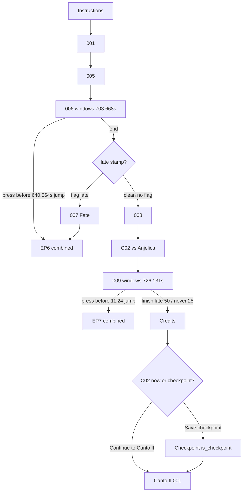

# Inferno Canto I rebuild (post–release-windows)

**Status:** Canto I scaffold regenerated + installed 2026-08-25. Funscripts/media in live pack. QA pending.

**Tracked copy:** this file  
**Cursor plan:** [../../.cursor/plans/inferno-c01-rebuild.plan.md](../../.cursor/plans/inferno-c01-rebuild.plan.md)

## Why rebuild

Engine supports **release timing windows**, so split rounds (`006`/`006.5`, `009`/`010`) go away. New cuts:

`E:\E-Stim\CH Inferno\Canto I\Seperated Rounds` + `CH Inferno Canto 1.mp4.csv`

Epilogue intro + fate → one clip per EP (`Inferno_C01_EPX.mp4`). Keep v1 punish/cooldown/unlock structure.

---

## Locked decisions

1. **Safe home** — mirror under `docs/plans/`; always backup to `E:\E-Stim\CH Inferno\Canto I\_journey_backups\<stamp>\`; after first good generate commit media-free `scripts/dev/erosphere-inferno/journey.structure.json`.
2. **EP media** — on-disk `Inferno_C01_EP1…7.mp4` are already combined intro+fate.
3. **010** — folded into **009**; windows choose fate (same pattern as 6.5).
4. **006 release behavior** (precise):
   - **Before ~10:40 (640.564s):** immediate jump → `inferno_C01_EP6` (skip 007).
   - **After 10:40:** stamp only; video **continues to end**; then route → `inferno_C01_007` → `inferno_C01_EP6`.
   - **Never press:** → `inferno_C01_008` → fork.
5. **Scope:** Canto I only this pass.

---

## Safe-home rules (locked)

| Location | Tracked? | Role |
|---|---|---|
| `docs/plans/inferno-c01-rebuild.plan.md` | Yes | Canonical structure write-up |
| `scripts/dev/erosphere-inferno/journey.structure.json` | Yes (to add) | Media-free graph snapshot after generate |
| `scripts/dev/erosphere-inferno/skill_unlocks.json` | Yes | Unlock inserts |
| `scripts/dev/scaffold_erosphere_inferno.py` | No (gitignored) | Generator — backup before every rewrite |
| `local/journeys/erosphere-inferno/` | No | Build output only — never sole copy |
| Live pack under `E:\E-Stim\Fap.Hero.JOURNEY…\Journeys\Erosphere_Inferno` | Outside repo | Playable; JSON-only installs |
| `E:\E-Stim\CH Inferno\Canto I\_journey_backups\<stamp>\` | Outside repo | Stamp copies of scaffold `.py` + `journey.json` |

**Agent hard rules:** never wipe a Journeys pack or `Seperated Rounds`; never regenerate into the live pack without `-SkipInstall` dry-run first; never treat `local/` as the only copy.

---

## Media inventory (locked)

| Segment | Duration | Notes |
|---|---|---|
| Instructions | 114.904s | |
| 001–005 | as CSV | unchanged roles |
| **006 Battle of River Styx** | **703.668s** | old 640.564 + 63.104 |
| **007 Fate** | 45.921s | late-release path only |
| 008 Decision | 57.587s | |
| A01 Divine Summoning | 6.249s | |
| **009 Anjelica's Dream** | **726.131s** | old ~684 + ~42 (**010 absorbed**) |
| Credits | 47.398s | |
| EP1–EP7 | ~84–117s | combined intro+fate |
| I01 / S01 | 23s / 23.6s | unlock cutscenes |

**Gone as separate nodes/files:** `006.5`, `010`, `EP*_Fate`.

---

## Main path



### `inferno_C01_006` — release windows

Boundary: **640.564s** (`until_ms: 640564`) ≈ 10:40.

| Band | On press | After round ends |
|---|---|---|
| `0 … 640.564s` | `jump_to: inferno_C01_EP6` | (left round) |
| `640.564s … end` | `flag` only (e.g. `c01_006_late_release`); **no jump** | unconditional `out` → tiny **fork**: has flag → `007`, else → `008` |
| never press | — | same fork → `008` |

`007` → `out` → `inferno_C01_EP6`. Coins: keep clean vs late-release economy near v1 (~75 before the C02/Anjelica fork).

Drop all `inferno_C01_006_5` / `fp_C01_006_5`; freeplay after 006 clear → hub directly.

### `inferno_C01_009` — release windows (010 folded in) — **locked**

Boundary: **11:24** = **684.000s** (`until_ms: 684000`).

Round `coins: 0` so the band table owns VP.

| Band | On press | If never pressed | Playback |
|---|---|---|---|
| `0 … 684.000s` | `jump_to: inferno_C01_EP7` | — | leaves round |
| `684.000s … end` | **50 coins**; no jump | **25 coins** at round end (`expire_coins: 25` on this open band) | video keeps playing → **Credits** |

Drop `inferno_C01_010`.

Authoring sketch:

```text
early: until=11:24, jump_to=inferno_C01_EP7
late:  until=0,     coins=50, expire_coins=25
out → inferno_C01_credits
```

### After Credits — Canto II or checkpoint — **locked**

`inferno_C01_credits` → **fork** (or equivalent choice UI):

1. **Continue to Canto II** → `inferno_C02_001` (play now).
2. **Save checkpoint** → dedicated node with `is_checkpoint: true`, sole `out` → `inferno_C02_001`.

Intent: player can stop after Canto I and later **Resume** into the checkpoint, then Continue into Canto II. No calendar cooldown on this pause.

`c01_008_fork` early skip (**Proceed to Canto II** vs **Dream of Anjelica**) stays; Anjelica path is the long way that ends at this post-credits choice.

---

## Epilogue graph

**Old:** EP video → `*_fate` → unlock? → gaps / punish → exit  
**New:** one `inferno_C01_EPX` (`Inferno_C01_EPX.mp4`, `items_blocked`) → unlock? → gaps / punish → exit  

`skill_unlocks.json`:

- EP5: `insert_after: inferno_C01_EP5`
- EP6: `insert_after: inferno_C01_EP6`

### Punishment matrix (v1, adjusted)

| EP | Trigger | After EPX | Exit |
|---|---|---|---|
| EP1 | 001 | gap 1d → 001 | same |
| EP2 | 002 | gap 3d → 001 | same |
| EP3 | 003 | gap 3d → 001 | same |
| EP4 | 004 | 3× (gap 1d → 004) → 005 | same |
| EP5 | 005 | Amulet → 5× (gap 1d → 005) → 006 | same |
| EP6 | 006 early **or** 007→EP6 | Psychic → 5× (gap 2d → 005+006) → **006** | was 006_5 |
| EP7 | 009 early (<11:24) | freeplay hubs (no 006_5) | clear hubs → credits → C02/checkpoint |

EP titles: single node per epilogue (copy-review Fate naming folds into EPX label).

---

## Scaffold / pack workflow

1. Copy current scaffold + any existing pack/`local` `journey.json` → `_journey_backups\<stamp>\`.
2. Rewrite Canto I in `scaffold_erosphere_inferno.py` + `skill_unlocks.json`.
3. `scaffold-erosphere-inferno.ps1 -SkipInstall` → inspect `local/journeys/…/journey.json`.
4. Write stripped `journey.structure.json` into `scripts/dev/erosphere-inferno/` for git.
5. Copy new MP4s into live pack media folder **without deleting** other files.
6. JSON-only install into live pack.
7. Builder + play QA.

---

## Open decisions

None for Canto I graph rules — ready to implement on go-ahead.

---


## Funscripts — **ready**

Source folder: \E:\\E-Stim\\CH Inferno\\Canto I\\Seperated Rounds\\Funscripts
Copy into the live pack beside matching MP4s at install time (JSON-only install still never deletes media).

## Non-goals

- Committing multi‑GB video into git
- Canto II/III this pass
- Release-windows engine changes
- Recovering pre-wipe journey from git (scaffolds were never tracked)
